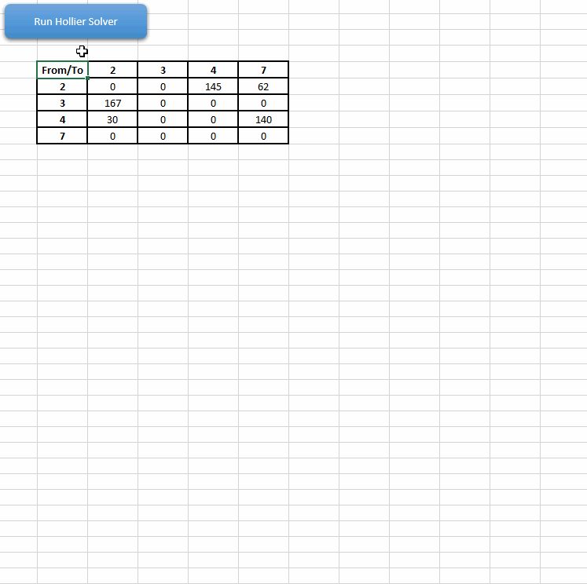

---

---

# Excel Hollier Solver

The Hollier Solver tool is an Excel add-in that takes a from-to table and solves it using the Hollier methods.

## Preview

  
Example Output

  

 

|Contents|
|---|
|1. [Introduction](#introduction)|
|&nbsp;&nbsp;&nbsp;1.1 [What are Hollier Methods?](#what-are-hollier-methods)|
|&nbsp;&nbsp;&nbsp;1.2 [Hollier Method 1 Algorithm](#hollier-method-1-algorithm)|
|2. [Installation and Use](#installation-and-use)|
|&nbsp;&nbsp;&nbsp;2.1 [How to Use the Solver](#how-to-use-the-solver)|
|&nbsp;&nbsp;&nbsp;2.2 [How to Add the Solver as an Add-in](#how-to-add-the-solver-as-an-add-in)|
|&nbsp;&nbsp;&nbsp;2.3 [How to Add the Solver to the Toolbar](#how-to-add-the-solver-to-the-toolbar)|
|&nbsp;&nbsp;&nbsp;2.4 [Terms of Service](#terms-of-service)|

# Introduction

## What are Hollier Methods?
Hollier methods are algorithms used to order machines to minimize the backtracking of parts. 
In the context of manufacturing, it is implemented after separating components of an assembly 
into part families, splitting them into machine groups using rank order clustering, and finally 
generating from-to tables of each group.

## Hollier Method 1 Algorithm
1. Develop a from-to chart based on part routes. 
1. Calculate the "to" and "from" sums for each machine.
1. Assign the machine position based on minimum "from" or "to" summations.
    - If a tie between two sums in the "from" or "to" category exists, the machine with the lowest from-to ratio is chosen.
    - If a tie between a "to" and "from" sum exists for the same machine, it is skipped, and the next machine with the minimal sum is chosen.
    - If a tie between a "to" and "from" category exists, the machines are assigned the next and last positions, respectively.
1. Eliminate the assigned machine from the from-to table and repeat the process until all machines have been assigned to a position.

# Installation and Use
The quickest way to run the program is to use the macro-enabled template file, 
`Hollier_Macro.xltm`. To keep this as a personal template that shows in the `New` 
tab in Excel, add the file to `C:\Users\<username>\Documents\Custom Office Templates`.

**Report An Issue:** If you discover any issues, please report them at [the issue tracker](https://github.com/TheEric960/Excel-Hollier-Solver/issues).

## How to Use the Solver
Use of the Hollier solver is simple:
1. Add a from-to table to the worksheet called `Hollier Solver`.
1. Click the `Run Hollier Solver` button and enter the following:
    - *Input Range*: Select the from-to table excluding any sum columns.
    - *Machine Labels*: If the machine labels were included in the input range, check this option.
    - *Output Range*: Select a cell for the program to output to.
    - *New Worksheet*: The program will output to a new worksheet.
    - *Holler Method 2*: Select this option if to solve using Hollier Method 2 as well.
    - *Flow Diagram*: Select this option to generate a flow diagram for each method.
1. Press `OK` to run the program.

### Warnings
 - Setups with a singular machine are not accounted for.
 - All nonzeros in the diagonal are not accounted for.

## How to Add the Solver as an Add-in
This option allows the program to be selected in the ribbon by navigating to `Add-ins > Hollier Solver`.

To add the solver as an Add-in:
1. Copy the `Hollier_Solver.xlam` file to `C:\Users\<USERNAME>\AppData\Roaming\Microsoft\AddIns`.
1. On the ribbon, navigate to `File > Options`. An option window should pop up.
1. Select `Add-ins` and on the bottom, select `Go...`
1. Check the `Hollier-Solver` box and choose `OK`.

> To uninstall, delete `Hollier_Solver.xlam` at `C:\Users\<USERNAME>\AppData\Roaming\Microsoft\AddIns` 
and restart Excel.

## How to Add the Solver to the Toolbar
Follow the steps in [this tutorial](https://www.excel-easy.com/vba/examples/add-a-macro-to-the-toolbar.html) 
beginning at **Step 8**.

## Terms of Service
As defined in the [BSD 3-Clause](https://github.com/TheEric960/Excel-Hollier-Solver/blob/master/LICENSE):

>THIS SOFTWARE IS PROVIDED BY THE COPYRIGHT HOLDERS AND CONTRIBUTORS "AS IS"
AND ANY EXPRESS OR IMPLIED WARRANTIES, INCLUDING, BUT NOT LIMITED TO, THE
IMPLIED WARRANTIES OF MERCHANTABILITY AND FITNESS FOR A PARTICULAR PURPOSE ARE
DISCLAIMED. IN NO EVENT SHALL THE COPYRIGHT HOLDER OR CONTRIBUTORS BE LIABLE
FOR ANY DIRECT, INDIRECT, INCIDENTAL, SPECIAL, EXEMPLARY, OR CONSEQUENTIAL
DAMAGES (INCLUDING, BUT NOT LIMITED TO, PROCUREMENT OF SUBSTITUTE GOODS OR
SERVICES; LOSS OF USE, DATA, OR PROFITS; OR BUSINESS INTERRUPTION) HOWEVER
CAUSED AND ON ANY THEORY OF LIABILITY, WHETHER IN CONTRACT, STRICT LIABILITY,
OR TORT (INCLUDING NEGLIGENCE OR OTHERWISE) ARISING IN ANY WAY OUT OF THE USE
OF THIS SOFTWARE, EVEN IF ADVISED OF THE POSSIBILITY OF SUCH DAMAGE.
